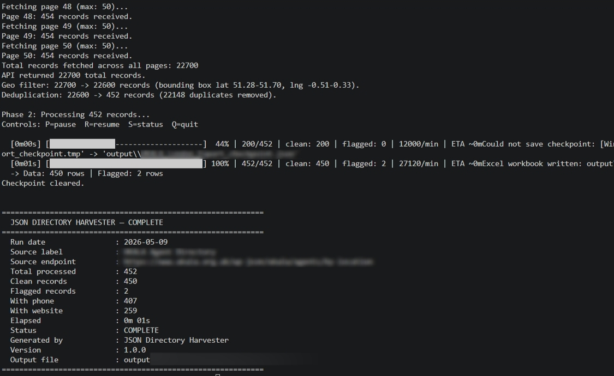
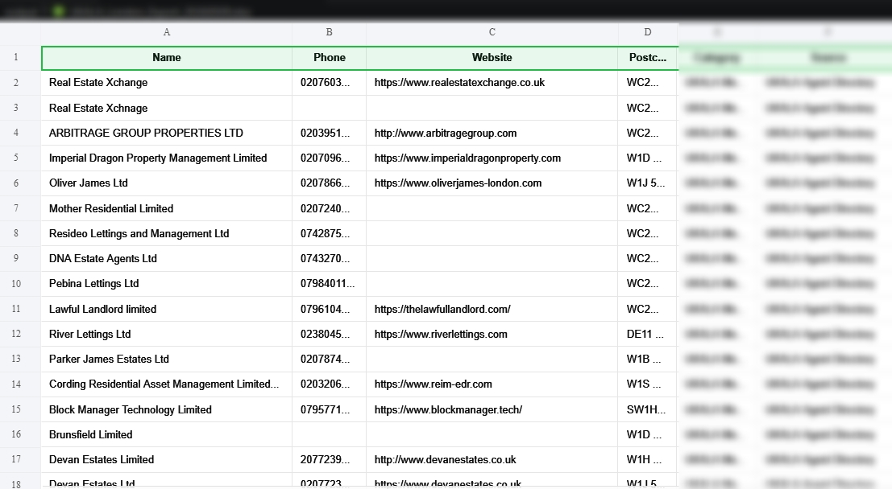

# JSON Directory Harvester

> A configurable, resumable Python pipeline for harvesting records from any JSON-based directory API — with geographic filtering, deduplication, data validation, and formatted three-sheet Excel export.

[](https://github.com/FAAQJAVED/json-directory-harvester/actions/workflows/ci.yml)
[](https://python.org)
[](LICENSE)
[](tests/)
[](https://github.com/FAAQJAVED/json-directory-harvester)

---

## Preview

| Terminal — live progress bar | Excel Output — three sheets |
|---|---|
|  |  |

---

## What It Does

JSON Directory Harvester fetches records from **any JSON-based directory API**, filters them by geographic bounding box, deduplicates them in two passes, validates each record against configurable rules, and exports the results to a professionally formatted Excel workbook.

Everything — the API endpoint, pagination style, field names, geo bounds, validation rules, and output format — is controlled by a single `config.yaml` file. **No source code changes are needed to point the tool at a new API.**

---

## How It Works

```
┌─────────────────────────────────────────────────────────────────┐
│  PHASE 1 — Fetch & Prepare                                      │
│                                                                 │
│  config.yaml ──► API endpoint (POST or GET)                    │
│                      │  paginated, configurable response path   │
│                      ▼                                          │
│                 raw_records[]                                   │
│                      │                                          │
│                      ├──► geo_filter()   ← lat/lng bounding box │
│                      ├──► dedup_records() ← ID, then name+post  │
│                      └──► checkpoint.save()  ← Phase 1 done     │
└──────────────────────────────┬──────────────────────────────────┘
                               │
┌──────────────────────────────▼──────────────────────────────────┐
│  PHASE 2 — Process Records                                      │
│                                                                 │
│  records[] ──► extract_row()  ← field mapping, HTML strip,     │
│                                  phone normalise, https prefix  │
│                    │                                            │
│                    ├──► validate_row() ──► CLEAN or FLAGGED     │
│                    └──► checkpoint.save() every N records       │
└──────────────────────────────┬──────────────────────────────────┘
                               │
┌──────────────────────────────▼──────────────────────────────────┐
│  PHASE 3 — Export                                               │
│                                                                 │
│  clean_rows[]   ──► Excel Sheet 1: Data                        │
│  flagged_rows[] ──► Excel Sheet 2: Flagged (with Flag Reason)  │
│  run stats{}    ──► Excel Sheet 3: Summary                     │
│                                                                 │
│  {prefix}_{YYYYMMDD}.xlsx  +  rotating .log file               │
└─────────────────────────────────────────────────────────────────┘
```

---

## Features

| Feature | Detail |
|---|---|
| **Config-driven** | API endpoint, pagination, field names, geo bounds, validation — all in `config.yaml`. Zero code changes to target a new API |
| **POST and GET** | Configurable HTTP method per endpoint |
| **Nested JSON navigation** | Dot-path `response_path` traverses any response structure: `["data", "results"]` → `response["data"]["results"]` |
| **Two pagination modes** | `page_in_path: false` (adds page as payload param) · `page_in_path: true` (substitutes `{page}` in URL path) |
| **Geographic bounding-box filter** | Optional lat/lng filter — restrict output to any city, region, or country |
| **Two-pass deduplication** | Pass 1: by record ID (richer record wins) · Pass 2: by name + postcode (case-insensitive) |
| **Configurable validation** | Name length, postcode requirement, postcode regex — all config-driven |
| **Three-sheet Excel export** | Data / Flagged / Summary with frozen headers, alternating row shading, and auto-width columns |
| **Checkpoint / resume** | Atomic JSON saves every N records — resume after any interruption with zero re-fetching |
| **Interactive keyboard controls** | P pause · R resume · S status · Q quit — no Enter needed on any platform |
| **Auto-protection** | Stop time · low-disk guard · consecutive-failure cap · retry queue |
| **Rotating log file** | 5 MB cap, 3 backups — full DEBUG to file, clean INFO to console |
| **Dry-run mode** | Reports counts without writing any files |
| **Environment variable overrides** | `SCRAPER_API_URL`, `SCRAPER_API_KEY` — secrets never in `config.yaml` |

---

## Quick Start

### 1. Clone and install

```bash
git clone https://github.com/FAAQJAVED/json-directory-harvester.git
cd json-directory-harvester
pip install -r requirements.txt
```

### 2. Configure

```bash
cp config.yaml.example config.yaml
```

Edit `config.yaml` — set your API URL, response path, field mapping, geo bounds, and output preferences. Every option is annotated in the example file.

### 3. Set secrets (optional)

```bash
cp .env.example .env
```

Add your API key to `.env`. It is injected at runtime via `SCRAPER_API_KEY` and never stored in `config.yaml`.

### 4. Run

```bash
# Standard run
python scraper.py

# Dry run — reports counts without writing files
python scraper.py --dry-run

# Use a different config file
python scraper.py --config my_config.yaml

# Start fresh (clears any saved checkpoint)
python scraper.py --reset
```

---

## Configuration Reference

### `api` section

| Key | Description |
|---|---|
| `url` | Full API endpoint URL. Can be overridden with `SCRAPER_API_URL` |
| `method` | `POST` or `GET` |
| `headers` | Dict of request headers (User-Agent, Content-Type, Referer, Origin, Authorization) |
| `payload` | POST body / GET query params |
| `response_path` | List of keys to navigate to the records list: `["data", "results"]` |

### `api.pagination` section

| Key | Description |
|---|---|
| `enabled` | Set `true` to enable multi-page fetching |
| `page_param` | Payload key for the page number (used when `page_in_path: false`) |
| `max_pages` | Hard ceiling on total pages fetched |
| `page_in_path` | If `true`, substitute `{page}` in the URL instead of adding a payload param |

### `geo_filter` section

| Key | Description |
|---|---|
| `enabled` | Toggle geographic filtering |
| `lat_min/max`, `lng_min/max` | Bounding box coordinates |
| `lat_field`, `lng_field` | Dot-path to lat/lng in each record (e.g. `"coordinates.latitude"`) |

### `field_mapping` section

Maps the scraper's logical field names (`id`, `name`, `phone`, `website`, `postcode`) to the actual key names in the API's JSON records.

### `output` section

| Key | Description |
|---|---|
| `directory` | Output folder for all generated files |
| `filename_prefix` | Prefix for Excel and log filenames |
| `category` | Value written to the Category column |
| `source` | Value written to the Source column |

### `validation` section

| Key | Description |
|---|---|
| `min_name_length` | Records with shorter names are flagged |
| `require_postcode` | Flag records with no postcode |
| `postcode_regex` | Regex pattern postcodes must match (blank = disabled) |

### `runtime` section

| Key | Default | Description |
|---|---|---|
| `stop_at` | `"23:00"` | HH:MM auto-stop time |
| `save_every` | `10` | Checkpoint every N records |
| `progress_every` | `10` | Log progress every N records |
| `request_timeout` | `15` | HTTP timeout in seconds |
| `low_disk_mb` | `500` | Auto-pause threshold (MB free) |
| `max_consec_fail` | `3` | Auto-pause after N consecutive failures |

---

## Output

### Excel workbook — `{prefix}_{YYYYMMDD}.xlsx`

| Sheet | Contents |
|---|---|
| **Data** | Clean, validated records — frozen header row, navy header, alternating row shading, auto-width columns |
| **Flagged** | Records that failed validation, each annotated with a `Flag Reason` column |
| **Summary** | Run metadata: date, record counts, elapsed time, source endpoint, version, status |

### Log file — `{prefix}_{YYYYMMDD}.log`

Rotating log file (5 MB max, 3 backups). Full DEBUG output with timestamps to file. Clean INFO-level only to console.

---

## Runtime Controls

While the scraper is running, press a key (no Enter needed on any platform):

| Key | Action |
|---|---|
| `P` | Pause processing |
| `R` | Resume after pause |
| `S` | Print current status (progress bar, counts, rate, ETA) |
| `Q` | Quit cleanly — saves checkpoint for resumption |

---

## Auto-Protection Features

| Feature | Trigger | Behaviour |
|---|---|---|
| Stop time | Configured HH:MM | Saves checkpoint and exits cleanly |
| Low disk guard | Free disk < `low_disk_mb` MB | Auto-pauses; resumes when R is pressed |
| Consecutive failure cap | N failures in a row | Auto-pauses; resets counter on resume |
| Retry queue | Any record-level exception | Failed records retried once after main loop |

---

## Resuming a Run

If a run is interrupted — by `Q`, stop time, disk guard, or any crash after Phase 1 completes — the checkpoint file is saved automatically. The next run detects it and resumes Phase 2 from where it stopped. Phase 1 (API fetching) is never repeated.

```bash
python scraper.py          # automatically resumes if checkpoint exists
python scraper.py --reset  # discard checkpoint and start fresh
```

---

## Project Structure

```
json-directory-harvester/
├── scraper.py            # CLI entry point — three-phase orchestrator
├── fetcher.py            # Paginated HTTP fetching (POST/GET, two pagination modes)
├── processor.py          # Geo filter, dedup, field extraction, validation (pure functions)
├── exporter.py           # Three-sheet Excel workbook builder
├── checkpoint.py         # Atomic JSON checkpoint save/load/clear
├── controls.py           # Cross-platform keyboard listener and audio feedback
├── config.py             # YAML loader with validation and env-var overrides
├── config.yaml.example   # Fully annotated configuration template
├── .env.example          # Secret injection template
├── requirements.txt      # Runtime dependencies
├── requirements-dev.txt  # Development and testing dependencies
├── pyproject.toml        # Package metadata and tool configuration
├── CHANGELOG.md          # Version history
├── CONTRIBUTING.md       # Contribution guidelines
├── LICENSE               # MIT
├── Assets/
│   ├── terminal_progress.png   # Screenshot — live progress bar
│   └── output_preview.png      # Screenshot — Excel output (three sheets)
└── tests/
    ├── __init__.py
    ├── test_processor.py  # 44 tests — all pure functions
    ├── test_fetcher.py    # 20 tests — mocked HTTP, both pagination modes
    └── test_checkpoint.py # 15 tests — save/load/clear/atomic write
```

---

## Running Tests

```bash
pip install -r requirements-dev.txt
pytest tests/ -v --cov=. --cov-report=term-missing
```

---

## Extending

| Goal | Where to change |
|---|---|
| Add a new output column | `processor.extract_row()` and `exporter.DATA_FIELDS` |
| Add a new validation rule | `processor.validate_row()` |
| Add a new field normaliser | New function in `processor.py` alongside `strip_html()` |
| Support a new auth scheme | `config._apply_env_overrides()` |
| Add a new runtime protection | Top of Phase 2 loop in `scraper.py` |

---

## Requirements

- Python 3.9+
- `requests` — HTTP fetching
- `pyyaml` — YAML config loading
- `openpyxl` — Excel workbook output
- `python-dotenv` — `.env` secret injection

See `requirements.txt` for pinned minimum versions.

---

## Part of the B2B Lead Toolkit

This tool is one component of a broader B2B lead generation pipeline targeting UK property management companies, letting agents, block managers, and HMO landlords.

| Repo | What it does |
|---|---|
| **[JSON Directory Harvester](https://github.com/FAAQJAVED/json-directory-harvester)** ← *you are here* | Harvests records from any JSON-based directory API |
| **[Google Maps Business Scraper](https://github.com/FAAQJAVED/Google-Maps-Business-Scraper)** | Extracts and enriches business listings from Google Maps |
| **[Email Phone Enrichment Tool](https://github.com/FAAQJAVED/Email-Phone-Number-Enrichment-Tool)** | Scrapes contact emails and phones from company websites |
| **[LeadHunter Pro](https://github.com/FAAQJAVED/Leadhunter_Pro)** | Multi-engine search scraper with HOT/WARM/COLD lead scoring |
| **[Trustpilot Business Scraper](https://github.com/FAAQJAVED/trustpilot-business-scraper)** | Extracts business listings from Trustpilot search results |

All five tools share the same Excel output schema (Data + Summary sheets) — results can be combined directly in Excel or imported together into a CRM.

---

## License

MIT © 2026 [FAAQJAVED](https://github.com/FAAQJAVED)
